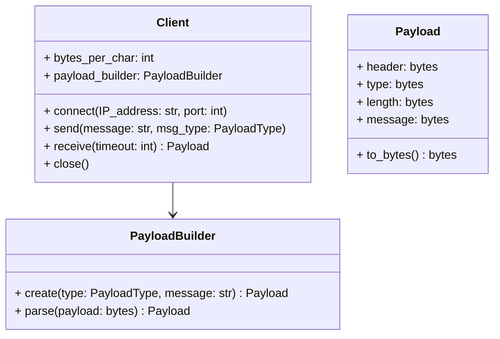
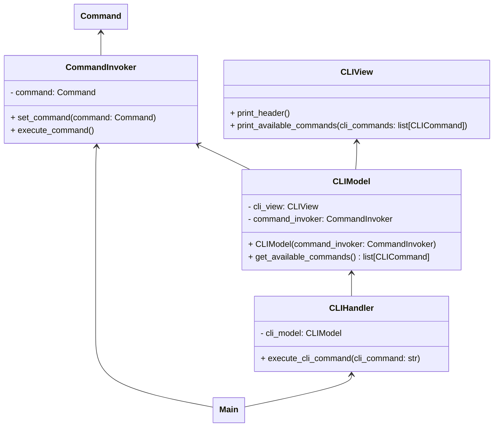

# Secure Chat App
Course project of 103.2 CrySec

# Objectives
* Design and implementation of a complete application with GUI and network communication
* Implementation of cryptographic methods
* Autonomous Development

# Constraints
* Python
* Initially CLI then GUI 
* Communication with a provided server

# Project Communication Protocol
Address: vlbelintrocrypto.hevs.ch
Port: 6000

## Overview
1. Transport Layer: TCP & Sockets
    * Communication happens over TCP, which ensures reliable and ordered message delivery as well as error-checks
    * Sockets are used, which are implemented using network programming APIs
2. Message format (General Structure):
    All messages follow a standard format that starts with a header
3. Connection rule
    * If the expected message structure is not followed, the connection is terminated

## Header
### Overview

* **1st, 2nd and 3rd bytes** : Always the string 'ISC' (used as a protocol identifier)
* **4th byte** : Indicates the type of message, which can be:
    * 't' -> Text message
    * 's' -> Server-only message (not broadcasted)
    * 'i' -> Image message

### Message
* **Text / Server Messages** ('t' or 's')
    * 5th & 6th bytes: Store the number of characters in the message (N) as a big-endian 2-byte integer
    * N * 4 bytes: The actual message, where:
        * Each char is 4 bytes long (big-endian order)
        * The string is UTF-8 encoded
    * Server-only messages ('s'): These are meant only for server communication and are not broadcast to all users
* **Image messages** ('i')
    * 5th byte: Image width (max 128 pixels)
    * 6th byte: Image height (max 128 pixels)
    * Following bytes: The image's pixel data in RGB format
        * Pixels are stored row by row (y-axis first, then x-axis)
        * Each pixel consists of 3 consecutive bytes(RGB-RGB-RGB)

# Implementation Notes
## CLI user input
* The user input can have multiple fields and each field might contain multiple options.
* The fields might be optional

# Diagrams
## TCP Client and payload Building

## CLI MVC and Command Pattern
The command pattern is used because this app will have a CLI and a GUI. Both do the exact same thing so we need to centralize the logic inside of commands

The MVC pattern was simplified to a MV and a base handler which parses the command and passes the parsed information to the model. Which in turns executes the desired command
